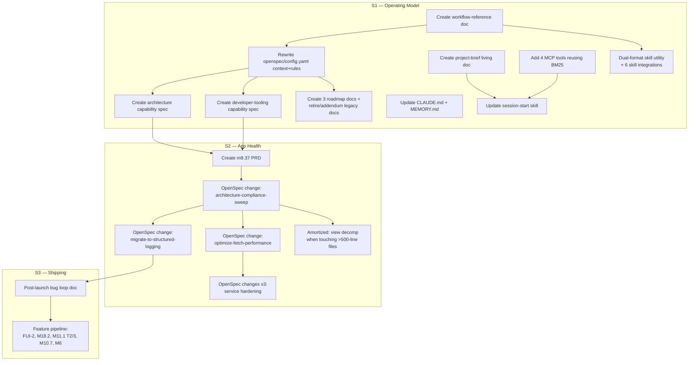

# Post-Launch Integrated Cleanup Plan (refined)

**Plan ID**: sprightly-quasar
**Created**: 2026-04-18
**Status**: Draft — awaiting user approval

> **On approval**: the only action is to save this document verbatim to `docs/prds/active/post-launch-integrated-cleanup.md` in the forager repo. No code/config/MCP changes will be made. Subsequent execution of the plan itself will happen in a later OpenSpec proposal session.

---

## Context

Forager v1.0 is in App Review (build 134, rejection round 2 resolved via Age Rating metadata update 2026-04-17). All work below is post-launch and does not block submission.

Three parallel concerns need to be planned together, not in isolation:

1. **Operating model** — Rich and Claude plan/propose/ship through a mix of legacy `M#.#.#` milestone numbering and nascent OpenSpec workflow. Documentation is scattered and drifts. Claude has no single canonical "what is this project right now" pointer.
2. **App health** — ~130h of architectural debt across four buckets (correctness, foundation, maintainability, enforcement). The sharpest risk: ADR 013 scope-aware fetch pattern has drifted (28 view files contain `@FetchRequest`, 6 view files contain direct `context.save()`), and there is no mechanical enforcement.
3. **Shipping rhythm** — post-launch bug reception needs structured logging in place before user reports arrive; feature pipeline (FUI-2, M18.2, M11.1 Tiers 2/3, M10.7, M6) must not re-introduce drift.

Intended outcome: fix the operating model first (multiplier on every subsequent change), then ship correctness fixes as the first post-launch change, then cascade foundation work and amortize maintainability into feature work. Forward-only naming migration — historical `M#.#.#` left intact; new work uses OpenSpec change IDs.

### Ground truth audit (2026-04-18)

The original draft referenced several artifacts as already existing. They do not. This plan treats them as creates, not edits.

| Artifact draft referenced | Actual state |
|---|---|
| `docs/prds/active/m9.37-architecture-compliance-sweep.md` | Does not exist — only `m7.7`, `m10.7`, `m11.1`, `milestone-6` PRDs are active |
| `docs/prds/active/post-launch-quality-roadmap.md` | Does not exist |
| `docs/openspec-workflow-reference.md` | Does not exist |
| `docs/project-brief.md` | Does not exist |
| `docs/project-roadmap.md` and `docs/roadmaps/*` | Do not exist |
| `openspec/specs/architecture/spec.md` | Does not exist — 9 domain specs exist, no cross-cutting spec |
| `openspec/specs/developer-tooling/spec.md` | Does not exist |
| Saves-in-views claim "3 sites" | Actually **6** sites in 6 files |
| `print()` migration claim "553 calls" | Actually **657** calls across 77 files |
| `@FetchRequest` claim "12 views" | Actually **45** occurrences across **28** files — scope sweep is larger than draft suggested |
| MCP server "0 new tools" baseline | Server already has **7** tools in `server.py` — expansion adds to these |
| `/architecture-audit` skill | Exists at `.claude/skills/architecture-audit/SKILL.md`; already includes factory/assign/scope/saves checks as manual grep instructions |

All other draft claims (Tools/mcp-knowledge BM25 pipeline, ADR inventory, skills list, etc.) are correct.

---

## Shape of the change

Hard edges above are ordering constraints; everything else can run in whatever session order is convenient.

---

## Scope Summary

| Stream | Effort | Character |
|---|---|---|
| S1 Operating Model | ~10–14h | Foundations + tooling — unlocks everything after |
| S2 App Health | ~80–110h | Correctness, perf, logging, service hardening |
| S3 Shipping | ongoing | Bug loop + feature pipeline; depends on S2 logging |
| **Total new/focused work** | **~90–125h** | View decomp (~40–50h) amortized, not a dedicated block |

---

## Cluster execution order

Useful unit is **session-level context sharing**, not literal simultaneity.

### Cluster A — Operating model foundations (~5–6h, 1 session)

Shares context: OpenSpec structure, ADR content, capability modeling. Must land before Cluster C.

1. **Create `docs/openspec-workflow-reference.md`** — canonical doc for change-id naming, proposal/design/tasks/spec-delta flow, forward-only policy. Seed from `openspec/changes/archive/2026-04-12-app-store-submission/` as the worked example. ~45 min.
2. **Rewrite `openspec/config.yaml`** — replace lines 26 (`Naming convention: M#.#.# format for milestones...`) and the tasks.md rule `"Use M#.#.# identifiers for task grouping"` with forward-only change-id language. Keep context about tech stack, architecture, key domains. ~15 min.
3. **Create `openspec/specs/architecture/spec.md`** — seed REQ-001..N from ADRs 007, 010, 012, 013, 014 + `service-layer-pattern.md`. Follow format from `openspec/specs/app-store-assets/spec.md`. ~1h.
4. **Create `openspec/specs/developer-tooling/spec.md`** — seed from the 21 skills in `.claude/skills/` + hooks + architecture-audit + core-data-audit. ~45 min.
5. **Create `docs/project-roadmap.md`** (parent, ~1 page) + `docs/roadmaps/operating-model-roadmap.md`, `app-health-roadmap.md`, `shipping-roadmap.md` (detail pages). ~1.5h.
6. **Legacy doc hygiene**: add forward-only addendum to `docs/project-naming-standards.md`; mark `docs/project-index.md` superseded by `docs/project-brief.md` (link pointer) — actual retirement happens after Cluster B creates the brief. ~15 min.
7. **Update `docs/next-prompt.md`** — replace `M9.37`, `M9.38`, `M9.39`, `M9.40` rows with their OpenSpec change IDs. ~10 min.

### Cluster B — Claude context infrastructure (~4–5h, 1 session)

Shares context: how Claude loads context, MCP server internals. Independent of Cluster A (can run in either order, but Cluster A first is cheaper because session-start references the workflow doc).

1. **Create `docs/project-brief.md`** — living summary with these sections: At a Glance, Capability Map (points to `openspec/specs/`), Service Registry (points to `Services/`), Skill Inventory (points to `.claude/skills/`), ADR Index (points to `docs/architecture/`), Active Work Pointer (points to `docs/current-story.md` + `docs/next-prompt.md`), Known Debt (points to app-health roadmap). ~1.5h.
2. **Extend `Tools/mcp-knowledge/src/server.py`** — add tools beyond the existing 7 (`search_knowledge`, `read_document`, `list_documents`, `get_project_status`, `get_newsletter_context`, `draft_newsletter_section`, `create_newsletter_draft`):
   - `get_capabilities()` → list `openspec/specs/*/spec.md` with summaries
   - `get_services()` → list `Services/*.swift` + role hints
   - `get_adr(number)` → fetch specific ADR from `docs/architecture/`
   - `get_active_work()` → return current-story.md + next-prompt.md extract
   All four reuse the existing `KnowledgeSearch` + `documents.load_all_documents` pipeline. ~2h.
3. **Update `.claude/skills/session-start/SKILL.md`** — read `docs/project-brief.md` + `docs/openspec-workflow-reference.md`; support dual-format status-line parsing (both `M#.#.#` and `<verb>-<kebab>`). ~30 min.
4. **Update `CLAUDE.md` + `MEMORY.md`** — naming section points to workflow reference; add memory file capturing "forward-only: historical untouched, new work uses change-id". ~30 min.
5. **Dual-format milestone-format utility** — one shared regex helper consumed by `new-milestone`, `milestone-complete`, `commit`, `pr`, `session-start`, `done`. Each skill updated to accept either format. ~1h.

### Cluster C — Correctness sweep (~16–20h, 1–2 sessions)

Requires Cluster A (needs `architecture` capability spec to exist for the change's delta). Produces `docs/prds/active/m9.37-architecture-compliance-sweep.md` as a **new** document, then runs OpenSpec flow.

1. **Write `docs/prds/active/m9.37-architecture-compliance-sweep.md`** — PRD covering scope sweep + saves-in-views + enforcement skill extensions + ADR 011 supersession + new ADR 015. ~1h.
2. **`/opsx:propose architecture-compliance-sweep`** — generates proposal/design/tasks + delta for `architecture` spec. ~30 min.
3. **Phase 1 — ADR 013 scope sweep (10–12h)**: audit all 28 files with `@FetchRequest` (45 occurrences); add `householdKey` predicate to every HouseholdScoped fetch that's missing one. Files to inspect (by `@FetchRequest` count per Grep result): `UnifiedSearchView` (4), `MealPlanRowView` (5), `WeeklyListsView` (3), `GroceryListDetailView` (3), `IngredientsView` (3), `RecipeListView` (2), `AddIngredientView` (2), `AddListItemView` (2), `MealPlanListView` (2), plus 19 single-occurrence files. Also audit `GroceryListItemService.resolveCategory` and `GroceryListItemService.resolveStore` for missing scope predicates.
4. **Phase 2 — saves-in-views (~1.5h)**: route the 6 saves through services:
   - `forager/Views/Grocery/WeeklyListsView.swift:401`
   - `forager/Views/Grocery/AddCategoryView.swift:142`
   - `forager/Views/MealPlanning/SelectMealPlanSheet.swift:364`
   - `forager/Views/MealPlanning/RecipePIckerSheet.swift:359`
   - `forager/Views/MealPlanning/MealPlanListView.swift:395`
   - `forager/Views/MealPlanning/MealPlanDetailView.swift:711`
5. **Phase 3 — harden `/architecture-audit` skill (~2h)**: convert current manual-grep instructions in `.claude/skills/architecture-audit/SKILL.md` into explicit pass/fail checks with expected counts; add "scope predicate present" and "no saves in views" as required checks.
6. **Phase 4 — ADR 011 supersession + ADR 015 (~2h)**: update `docs/architecture/011-tab-architecture-reduction.md` status + create `docs/architecture/015-<new>.md` capturing the enforcement learnings.
7. **`/build` + tests + `/pr` + `/release-prep`**.

### Cluster D — Perf + logging (~14–17h, 2 sessions)

Logging first because S3 bug loop depends on it.

1. `/opsx:propose migrate-to-structured-logging` — 657 `print()` calls across 77 files → `Logger` / `DiagnosticLogger` / `DebugLogService`. `Services/HouseholdService.swift` (162 prints) and `Services/MealPlanService.swift` (25) are the largest targets. ~6–8h.
2. `/opsx:propose optimize-fetch-performance` — `fetchBatchSize` + `relationshipKeyPathsForPrefetching` on hot fetches. ~7–9h.

### Cluster E — Service hardening (~50h, 3 changes)

Only after Cluster C. Split to keep each change reviewable:

1. `add-service-test-coverage` — fill gaps beyond the 26 test files already in `foragerTests/` + `foragerTests/Services/`. ~24h.
2. `harden-service-injection-and-saves` — remove singletons from `MealPlanService`, `UserPreferencesService`, `LLMSettingsService`; route 61 service-level `save()` calls through `PersistenceController+ScopedWrite` or equivalent. ~14h.
3. `standardize-service-async-patterns` — async write methods for Recipe/WeeklyList/MealPlan/GroceryListItem/IngredientTemplate services; standardize `@Published errorMessage` in `LLMSettingsService`. ~12h.

### Ongoing

- **View decomposition** — rule: any OpenSpec change touching a view file >500 lines extracts ≥1 subview as part of its scope.
- **Feature pipeline** — FUI-2, M18.2, M11.1 Tiers 2/3, M10.7, M6 all use OpenSpec change-id naming for new branches/changes; old M-ids stay in existing PRDs until those PRDs are pulled in.

---

## Critical files

### Cluster A (create unless noted)
- `docs/openspec-workflow-reference.md` (create)
- `openspec/config.yaml` (edit — 39 lines currently; touch lines ~26 and tasks.md rule)
- `openspec/specs/architecture/spec.md` (create)
- `openspec/specs/developer-tooling/spec.md` (create)
- `docs/project-roadmap.md` (create)
- `docs/roadmaps/operating-model-roadmap.md` (create)
- `docs/roadmaps/app-health-roadmap.md` (create)
- `docs/roadmaps/shipping-roadmap.md` (create)
- `docs/project-naming-standards.md` (edit — add addendum)
- `docs/project-index.md` (edit — supersession pointer; actual retirement after project-brief exists)
- `docs/next-prompt.md` (edit — swap M-ids for change-ids)

### Cluster B
- `docs/project-brief.md` (create)
- `Tools/mcp-knowledge/src/server.py` (edit — add 4 tools after line 436)
- `Tools/mcp-knowledge/pyproject.toml` (edit — bump version)
- `.claude/skills/session-start/SKILL.md` (edit — 85 lines currently)
- `CLAUDE.md` (edit — 137 lines currently)
- `~/.claude/projects/-Users-rich-Development-forager/memory/MEMORY.md` (edit + new memory file)
- `.claude/skills/{new-milestone,milestone-complete,commit,pr,done}/SKILL.md` (edit — integrate dual-format util)

### Cluster C
- `docs/prds/active/m9.37-architecture-compliance-sweep.md` (create)
- 28 view files under `forager/Views/` and `forager/Debug/` + `forager/Components/` containing `@FetchRequest` (edit as needed)
- 6 saves-in-views files (edit — list above)
- `Services/GroceryListItemService.swift` (edit — scope resolve methods)
- `.claude/skills/architecture-audit/SKILL.md` (edit — tighten checks)
- `docs/architecture/011-tab-architecture-reduction.md` (edit — mark SUPERSEDED)
- `docs/architecture/015-<name>.md` (create)

---

## Reusables (don't re-invent)

- `Services/Persistence/HouseholdScopeProvider.swift` — scope source of truth; every missing predicate in Cluster C should read `currentHouseholdKey` from here.
- `Services/Persistence/ManagedObjectFactory.swift` — enforcement pattern mirror for scope-check skill logic.
- `Services/Persistence/PersistenceController+ScopedWrite.swift` — target for Cluster E service-save routing.
- `Tools/mcp-knowledge/src/{indexer,search,documents}.py` — BM25 pipeline; 4 new tools reuse `_ensure_indexed()` and `KnowledgeSearch.search`.
- `openspec/changes/archive/2026-04-12-app-store-submission/proposal.md` — worked proposal example for workflow-reference and new proposals.
- `openspec/specs/app-store-assets/spec.md` — spec shape to copy when seeding `architecture` and `developer-tooling`.
- `.claude/skills/architecture-audit/SKILL.md` — extend rather than rewrite.

---

## Verification

### Cluster A
- `openspec/config.yaml` no longer contains literal `M#.#.# format` or `Use M#.#.# identifiers`.
- `openspec/specs/architecture/spec.md` and `openspec/specs/developer-tooling/spec.md` exist and validate against the format of `openspec/specs/app-store-assets/spec.md` (REQ-### + Scenario lines).
- `docs/project-roadmap.md` links resolve to all three `docs/roadmaps/*-roadmap.md` files.
- `docs/project-naming-standards.md` has a top-of-file addendum pointing to `docs/openspec-workflow-reference.md`.
- `docs/next-prompt.md` post-launch backlog table has zero `M9.3[7-9]`/`M9.40` identifiers remaining.

### Cluster B
- `docs/project-brief.md` exists with all 7 required sections.
- From a fresh Claude Code session: MCP integration test invokes each of 4 new tools (`get_capabilities`, `get_services`, `get_adr`, `get_active_work`) and each returns non-empty structured output.
- `/session-start` output includes a reference to `docs/project-brief.md` and `docs/openspec-workflow-reference.md`.
- Dual-format utility accepts both `M9.16` and `architecture-compliance-sweep`; one shared regex used by all 6 skills.

### Cluster C
- `grep -rn '@FetchRequest' forager/ --include='*.swift'` — every HouseholdScoped-entity fetch has `householdKey` predicate (manual audit of 45 occurrences).
- `grep -rnE '(viewContext|context)\.save\(\)' forager/Views/ --include='*.swift'` — **0 results** (currently 6).
- `Services/GroceryListItemService.swift` scope-resolve methods include `householdKey` predicate.
- `/architecture-audit` skill runs clean; its checks now fail loudly on missing scope or saves-in-views.
- ADR 011 marked SUPERSEDED; ADR 015 exists.
- `/build` and existing test suites (foragerTests + foragerUITests) pass.
- Manual two-household scope-switch smoke test on iPhone 17 Pro simulator — no cross-household data leak in any of the 28 audited views.

### Cluster D
- `grep -rn 'print(' Services/ forager/ Models/ --include='*.swift'` ≈ 0 outside explicitly-preserved entry points (compared against current 657).
- Service fetches in hot paths set `fetchBatchSize`; loop-heavy fetches use `relationshipKeyPathsForPrefetching`.
- Device log retrieval works on TestFlight build (manual).

### Cluster E
- Every file in `Services/` top-level that writes Core Data has a matching test under `foragerTests/Services/`.
- `grep -rn 'static let shared' Services/ --include='*.swift'` — no matches for `MealPlanService`, `UserPreferencesService`, `LLMSettingsService`.
- 61 non-Persistence service-level `context.save()` calls routed through `PersistenceController+ScopedWrite` (currently 61 direct calls outside `Services/Persistence/`).

### Ongoing
- Quarterly: `docs/project-brief.md` reviewed and updated.
- Per change: `/architecture-audit` run pre-PR, zero new violations.

---

## Open questions

All prior decisions confirmed by user:
1. Parent doc at `docs/project-roadmap.md` + three detail docs.
2. Add 4 new MCP tools (revised from 6 — `search_knowledge` and `list_documents` already cover search/recents).
3. Dual-format skill migration (both formats accepted).
4. No pause for launch approval — all work is post-launch.

No remaining open questions. Plan ready to execute on approval.
